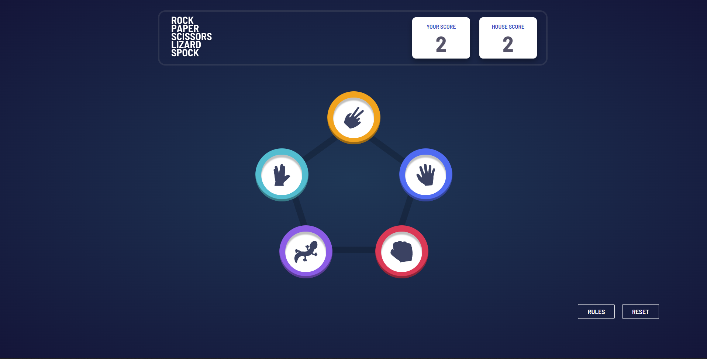
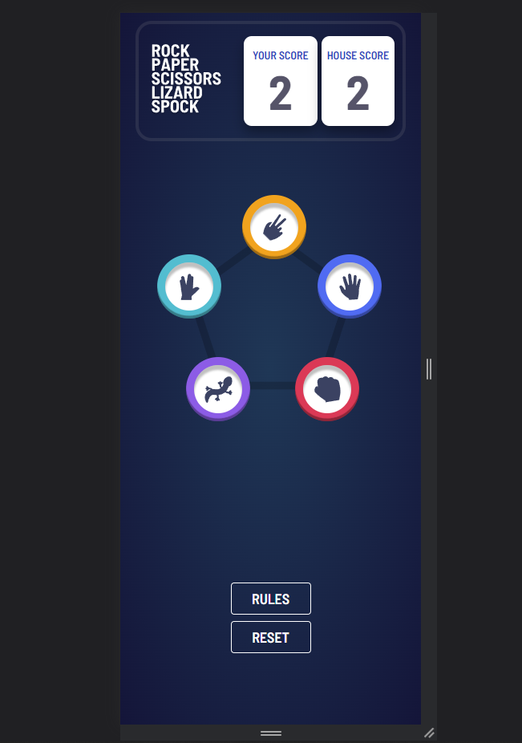

# Rock-paper-scissors App
## Table of contents

- [Overview](#overview)
  - [The challenge](#the-challenge)
  - [Screenshot](#screenshot)
  - [Links](#links)
- [My process](#my-process)
  - [Built with](#built-with)
  - [What I learned](#what-i-learned)
  - [Continued development](#continued-development)
  - [Useful resources](#useful-resources)
- [Author](#author)


## Overview

- creating an application that can run the game rock-paper-scissors, with no issues on mobile

### The challenge

### Screenshot




### Links

- Frontend Mentor - [@Asantae](https://www.frontendmentor.io/profile/Asantae)
- GIthub URL: [https://github.com/Asantae/]
- Live Site URL: [https://stately-cactus-9fa8fc.netlify.app/]

## My process


### Built with

- Semantic HTML5 markup
- CSS
- API
- Javascript

### What I learned

```js

```
### Continued development


### Useful resources

- [Example resource 1](https://stackoverflow.com/) - A lot of the solutions that I couldn't figure out on my own were from this site. It also provided inspiration a lot of times for different js solutions/error handling

## Author

- Twitter - [@Adoxyl](https://www.twitter.com/Adoxyl)

